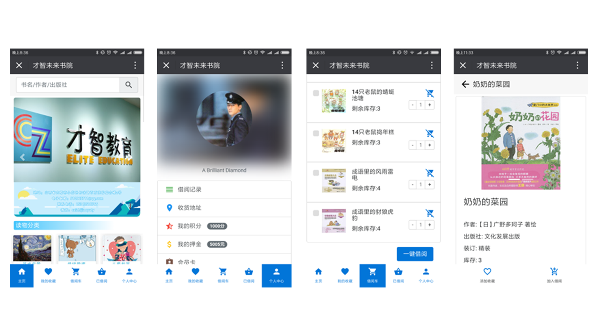

## 图书借阅

### 概述
- 本项目是一个2017年在校时的毕业设计项目
- 一个基于微信内置浏览器的在线图书借阅平台，实现了在线借阅以及退还、订单管理、押金管理、收货地址等一系列功能，同时具备完善的管理员后台功能
- 接入了微信API，实现了微信授权登录以及微信支付功能，使用Bootstrap开发了在微信内置浏览器中展示的响应式布局界面

### 项目截图

### 本地开发运行部署
- 克隆项目至本地 `git clone https://github.com/liuweigeek/iBorrow.git`
- 安装MySQL，执行项目目录下的`environment/iborrow.sql`，将数据导入MySQL中
- 修改`src/main/resources/jdbc.properties`中的数据库连接配置
- 在`src/main/java/com/zhinang/iborrow/constant/Constant.java#weixin`中，添加自己在微信公众平台申请的AppId、AppSecret等信息
- 将`environment/iborrow.conf`的配置，添加至nginx中，转发的Tomcat端口以及文件保存路径，修改为自己的
- 初始化的示例图片资源，可以在`https://github.com/liuweigeek/iBorrow_images_resource.git`中下载，并添加到自己的本地路径中
- 后台管理访问地址<http://localhost:80/admin>，默认登录信息为:(手机号:18666666666，密码:12345678)